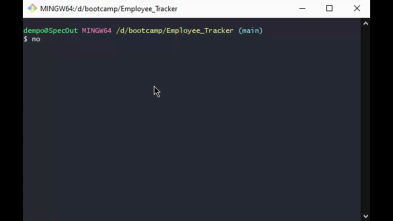

# Employee Tracker

## Description <br>
The application is a command line program to track employees in a database with mysql. The database contains three tables; a departments table, roles table, and employees table. The program tracks the employee's id, name, role, manager, department, and salary. Users can choose to view the 3 tables, add departments, add roles, add employees, or update employee roles.
<br>
[Demo Video](https://drive.google.com/file/d/1ORBggtWr0fwgst9PZ9pAk6e127GiwKYG/view?usp=sharing)
<br>
Included in the link above is a demo video of the application
<br>

<br>

<br>

<br>


## Table of Contents
[Installation](#Installation)<br>
[Usage](#Usage)<br>
[License](#Employee-Tracker)<br>
[Contributing](#Contributing)<br>
[Tests](#Tests)<br>
[Questions](#Questions)<br>
    

## Installation
To install the application first clone the repository to the desired directory.
- install all package dependencies with 
```
npm i
```
- start a mysql shell to run the schema and seed
```
mysql -u root -p
```
- after entering your root password run the following commands to run the schema and seeds:
- running the seeds.sql is optional
```
source ./db/schema.sql
source ./db/seeds.sql // optional

quit
```

## Usage
- enter the following command to start the application
```
node index.js
```
- Users can view the tables for departments, roles, and employees
- Users can add new departments, new roles, and new employees
- Users can also update the roles on existing employees

## Contributing
To contribute to the project create a fork of the repository. Create a pull request for any changes you would like to add.

## Tests
There are no tests written for the application

## Questions
If you have any questions about the repo, open an issue or contact me directly at [Dempoleon@gmail.com](Dempoleon@gmail.com).
You can find more of my work at [Dempleon](https://github.com/Dempleon)


